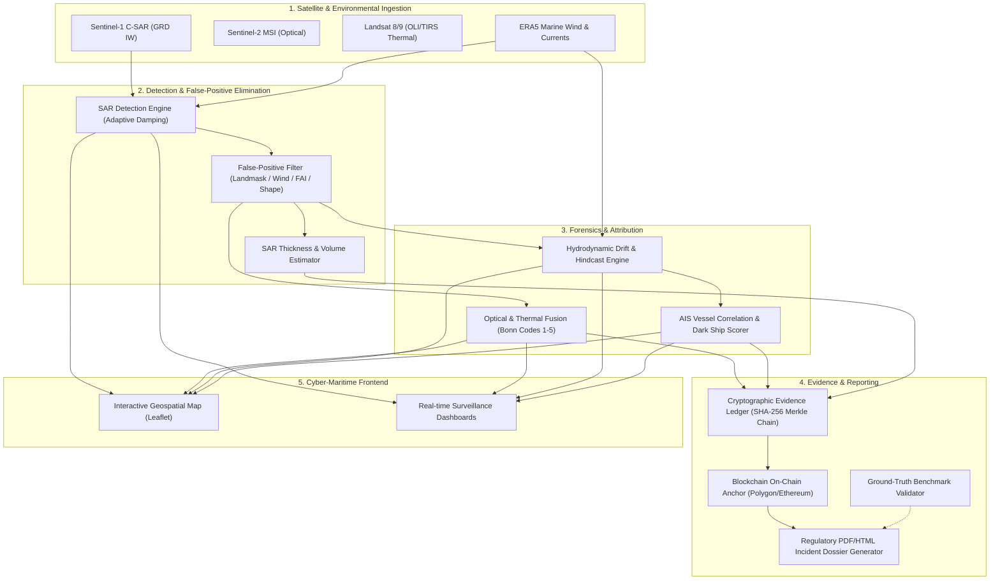

# Sentinel Marine Oil Spill Detection & Forensics System
## Complete System Features & Technical Architecture Guide

---

## Executive Summary & System Overview

The **Sentinel Marine Oil Spill Detection & Attribution System** is an end-to-end, multi-sensor Earth Observation (EO) intelligence and maritime forensics platform. It combines **Copernicus Sentinel-1 Synthetic Aperture Radar (SAR)**, **Sentinel-2 MSI**, **USGS/NASA Landsat 8/9 OLI & TIRS**, **Global Automatic Identification System (AIS) vessel tracking**, and **hydrodynamic drift simulation** to detect marine oil slicks, eliminate false positives, reconstruct drift trajectories, attribute offending vessels, and assemble cryptographically verifiable evidence dossiers.

---

## Feature-by-Feature Deep Dive

### 1. Sentinel-1 SAR Dark-Spot Detection Engine
* **Primary Source Code**: [`backend/app/services/sar_engine.py`](file:///c:/Users/dhanu/SIH7926/backend/app/services/sar_engine.py)
* **What it Does**:
  * **Radiometric Calibration**: Ingests Sentinel-1 Interferometric Wide (IW) Ground Range Detected (GRD) products and converts raw digital numbers into normalized radar backscatter cross-section ($\sigma^0$ in dB).
  * **Ocean Masking**: Applies a server-side permanent water mask (JRC Global Surface Water > 80%) to prevent inland water and land from polluting candidate segmentation.
  * **Speckle Reduction**: Utilizes focal median and Enhanced Lee spatial filtering to reduce radar speckle noise while preserving crisp slick boundaries.
  * **Adaptive Thresholding**: Dynamically segments dark spots where oil dampens ocean capillary-gravity waves using the adaptive formula:
    $$T = \mu_{\text{AOI}} - (1.8 \cdot \sigma_{\text{AOI}} \cdot \text{Sensitivity})$$
  * **Vectorization & Geospatial Metrics**: Converts segmented raster masks into WGS84 GeoJSON polygons and projects them into local Universal Transverse Mercator (UTM) zones to calculate exact geodesic area ($\text{km}^2$), perimeter ($\text{km}$), length, width, and Minimum Rotated Rectangles (MRR).

---

### 2. Multi-Stage False Positive Rejection Pipeline
* **Primary Source Code**: [`backend/app/services/false_positive_filter.py`](file:///c:/Users/dhanu/SIH7926/backend/app/services/false_positive_filter.py)
* **What it Does**:
  * Eliminates false alarms caused by natural oceanographic and atmospheric phenomena:
    1. **GSHHG Coastline & Land Masking**: Samples polygon centroids, boundaries, and interior grids against the Global Self-consistent Hierarchical High-resolution Geography dataset to reject inland reservoirs, dry mudflats, and coastal radar shadows (max land fraction limit = 20%).
    2. **ERA5 Synoptic Wind Gating**: Enforces valid wind speed bounds ($3.0\text{ m/s} \le V_{\text{wind}} \le 14.0\text{ m/s}$). Wind $< 3.0\text{ m/s}$ causes specular calm-water reflection look-alikes; wind $> 14.0\text{ m/s}$ induces heavy wave mixing that disperses slicks.
    3. **Isoperimetric Quotient (Circularity) Test**: Computes $Q = \frac{4\pi \cdot \text{Area}}{\text{Perimeter}^2}$. Circular features ($Q > 0.60$ for small patches) are rejected as natural calm-water pools.
    4. **Elongation & Aspect Ratio Test**: Enforces aspect ratio $\ge 1.8$ to prioritize elongated, curvilinear streaks typical of oil released in marine currents.
    5. **Dual-Polarization ($VV / VH$) Verification**: Checks cross-polarization damping ratio ($3.0\text{ dB} \le \sigma^0_{VV} - \sigma^0_{VH} \le 14.0\text{ dB}$) to identify and reject atmospheric rain downbursts and instrument noise floors.

---

### 3. Multi-Satellite Optical & Thermal Cross-Validation (Bonn Agreement)
* **Primary Source Code**: [`backend/app/services/optical_fusion_service.py`](file:///c:/Users/dhanu/SIH7926/backend/app/services/optical_fusion_service.py)
* **What it Does**:
  * **Multi-Constellation Queries**: Dispatches automated queries across Sentinel-2 (MSI), Landsat 8 (OLI/TIRS), and Landsat 9 (OLI-2/TIRS-2) within $\pm 48\text{h}$ of detection with $< 20\%$ cloud cover.
  * **Spectral Water/Vegetation Indices**:
    * **NDWI** (Normalized Difference Water Index): $\frac{Green - NIR}{Green + NIR}$ validates open water.
    * **NDVI** (Normalized Difference Vegetation Index): $\frac{NIR - Red}{NIR + Red}$ detects and rejects terrestrial vegetation.
  * **Floating Algae Index (FAI) Biogenic Rejection**:
    $$FAI = R_{NIR} - \left(R_{RED} + (R_{SWIR} - R_{RED}) \cdot \frac{\lambda_{NIR} - \lambda_{RED}}{\lambda_{SWIR} - \lambda_{RED}}\right)$$
    Identifies and discards natural biogenic slicks (Sargassum, macro-algae, green algal blooms) where $FAI > 0.025$.
  * **Bonn Agreement Oil Appearance Code (BAOAC)**: Performs KMeans color clustering in HSV/RGB space to classify slicks into international standard codes:
    * **Code 1**: Sheen ($0.04 - 0.3\ \mu\text{m}$, silvery-grey reflection).
    * **Code 2**: Rainbow ($0.3 - 5.0\ \mu\text{m}$, iridescent colors).
    * **Code 3**: Metallic ($5.0 - 50.0\ \mu\text{m}$, dull metallic sheen).
    * **Code 4**: Discontinuous True Oil ($50 - 200\ \mu\text{m}$, dark brown/black patches).
    * **Code 5**: Continuous True Oil ($> 200\ \mu\text{m}$, heavy dark oil emulsion).
  * **TIRS Thermal Infrared Radiometry**: Extracts Landsat 8/9 Band 10 brightness temperature ($K$) to calculate $\Delta T$ thermal anomalies over thick emulsions ($+0.5\text{K}$ to $+3.5\text{K}$ due to solar absorption).

---

### 4. Hydrodynamic Drift & Trajectory Hindcast / Forecast
* **Primary Source Code**: [`backend/app/services/drift_engine.py`](file:///c:/Users/dhanu/SIH7926/backend/app/services/drift_engine.py), [`backend/app/services/hydrodynamics.py`](file:///c:/Users/dhanu/SIH7926/backend/app/services/hydrodynamics.py)
* **What it Does**:
  * **Eulerian-Lagrangian Particle Tracking**: Models the transport of oil parcels using physical hydrodynamic forcing equations:
    $$\vec{V}_{\text{drift}} = \vec{V}_{\text{ocean}} + \alpha \cdot \mathbf{R}(\theta_{\text{Coriolis}}) \cdot \vec{V}_{\text{wind}} + \vec{V}_{\text{turbulent\_diffusion}}$$
  * **Wind Leeway**: Applies the standard 3.0% windage coefficient ($\alpha = 0.03$) with a $15^\circ$ Coriolis deflection angle in the Northern Hemisphere.
  * **Tidal Dynamics**: Incorporates the principal lunar semi-diurnal $M_2$ tidal constituent ($T \approx 12.42\text{ hours}$) and regional geostrophic currents.
  * **Forward Forecast & Backward Hindcast**:
    * **Forward Simulation (0 to +72h)**: Predicts spill trajectory, coastal landfall threat, and trajectory expansion cones.
    * **Backward Hindcast (0 to -48h)**: Traces the spill backwards in time to determine the exact spatiotemporal origin coordinates where the illegal discharge occurred.

---

### 5. AIS Vessel Intelligence & Spatiotemporal Attribution
* **Primary Source Code**: [`backend/app/services/ais_engine.py`](file:///c:/Users/dhanu/SIH7926/backend/app/services/ais_engine.py), [`backend/app/services/ais_importer.py`](file:///c:/Users/dhanu/SIH7926/backend/app/services/ais_importer.py), [`backend/app/services/live_ais_service.py`](file:///c:/Users/dhanu/SIH7926/backend/app/services/live_ais_service.py)
* **What it Does**:
  * **Vessel Track Ingestion**: Queries global AIS feeds (real-time stream or historical archive) for all commercial vessels (tankers, cargo, container, tugs, fishing) in the AOI.
  * **Closest Point of Approach (CPA)**: Calculates geodesic distance from every AIS trajectory point to the hindcasted spill origin location.
  * **Temporal Alignment**: Computes time delta between vessel transit and estimated spill age.
  * **Attribution Confidence Ranking**: Combines spatial proximity ($d_{\text{CPA}}$), temporal coincidence ($\Delta t$), vessel type (crude tanker vs passenger), and speed profiles to assign a suspect attribution probability score ($0 - 100\%$).

---

### 6. Multi-Factor Vessel Anomaly Scoring & Dark Ship Detection
* **Primary Source Code**: [`backend/app/services/anomaly_scorer.py`](file:///c:/Users/dhanu/SIH7926/backend/app/services/anomaly_scorer.py), [`backend/app/services/ais_engine.py`](file:///c:/Users/dhanu/SIH7926/backend/app/services/ais_engine.py)
* **What it Does**:
  * In illegal marine discharges (bilge dumping, tank stripping, or illicit Ship-to-Ship crude transfers), offending vessels often exhibit abnormal kinematic maneuvers or intentionally turn off their Automatic Identification System (AIS) Class A transponders ("**Going Dark**") to evade port authorities and satellite surveillance.
  * The Anomaly & Attribution Engine combines unsupervised Machine Learning (**scikit-learn Isolation Forest**) with deterministic kinematic heuristics across an **8-dimensional feature vector**.

#### A. The 8-Dimensional Kinematic Feature Vector
For every candidate vessel within the spatial-temporal investigation envelope, the system extracts:
1. **`min_distance_to_origin_km` ($d_{\text{CPA}}$)**: Geodesic Closest Point of Approach to the hindcast spill origin.
2. **`time_near_origin_hours` ($t_{\text{near}}$)**: Cumulative time elapsed while inside the $15\text{ km}$ incident buffer.
3. **`speed_change_variance` ($\text{Var}(\text{SOG})$)**: Fluctuations in Speed Over Ground ($\text{knots}$). Detects speed drops from $14\text{ knots}$ cruising down to $3-6\text{ knots}$ (the speed profile used during oily bilge pumping or tank washing).
4. **`course_change_frequency` ($\text{Freq}(\text{COG})$)**: Frequency of Course Over Ground changes $> 15^\circ$, identifying evasive zig-zagging or circular holding patterns.
5. **`loitering_score` ($S_{\text{loiter}}$)**: Ratio of cumulative trajectory length to net displacement:
   $$S_{\text{loiter}} = 1.0 - \frac{\|\vec{x}_{\text{end}} - \vec{x}_{\text{start}}\|}{\sum \|\vec{x}_{i+1} - \vec{x}_i\|}$$
6. **`route_deviation_score` ($S_{\text{deviation}}$)**: Perpendicular deviation from established commercial shipping channels (Traffic Separation Schemes - TSS).
7. **`ais_gap_duration_hours` ($t_{\text{gap}}$)**: Maximum silent transponder interval ($\max(t_{i+1} - t_i)$), indicating deliberate AIS deactivation.
8. **`bearing_alignment_with_drift` ($\theta_{\text{align}}$)**: Vector alignment $|\cos(\theta_{\text{vessel\_heading}} - \theta_{\text{slick\_orientation}})|$. Fresh spills form linear streaks aligned with the discharge vessel's heading.

#### B. Machine Learning Anomaly Detection (Isolation Forest)
* An **Isolation Forest** with 100 decision trees isolates anomalous vessels in the 8-dimensional feature space.
* Normal traffic clusters tightly (constant speed, straight tracks, active AIS), whereas polluters require fewer tree splits to isolate, generating high outlier scores:
  $$\text{Raw Score} = -\text{DecisionFunction}(X) \implies S_{\text{ML}} = \frac{\text{Raw} - \text{Raw}_{\min}}{\text{Raw}_{\max} - \text{Raw}_{\min}} \in [0.0, 1.0]$$

#### C. The 4 Component Forensic Sub-Scores
The system computes four transparent component scores:
* **Proximity Score ($S_{\text{prox}}$)**:
  $$S_{\text{prox}} = \begin{cases} 1.0 - \frac{d_{\text{CPA}}}{R_{\text{investigation}}} & \text{if } d_{\text{CPA}} \le R_{\text{investigation}} \\ 0.0 & \text{otherwise} \end{cases}$$
* **Temporal Score ($S_{\text{temp}}$)**:
  $$S_{\text{temp}} = \min\left(1.0, \max\left(0.0, \frac{t_{\text{near\_origin}}}{4.0\text{ hours}}\right)\right)$$
* **Trajectory & Maneuvering Score ($S_{\text{traj}}$)**:
  $$S_{\text{traj}} = 0.4 \cdot S_{\text{loiter}} + 0.3 \cdot S_{\text{deviation}} + 0.3 \cdot \min\left(1.0, \frac{t_{\text{ais\_gap}}}{3.0\text{ hours}}\right)$$
* **ML Anomaly Score ($S_{\text{ML}}$)**: Output of the normalized Isolation Forest model.

#### D. Composite Suspect Attribution Score
$$\text{Suspect Score} = \frac{w_{\text{prox}} \cdot S_{\text{prox}} + w_{\text{temp}} \cdot S_{\text{temp}} + w_{\text{traj}} \cdot S_{\text{traj}} + w_{\text{ML}} \cdot S_{\text{ML}}}{w_{\text{prox}} + w_{\text{temp}} + w_{\text{traj}} + w_{\text{ML}}}$$
* **Configured Weights**: $35\%$ Proximity, $25\%$ Temporal Alignment, $20\%$ Trajectory Deviations, $20\%$ Isolation Forest ML Anomaly.
* **Risk Classification**: Candidates are ranked into `LOW` ($< 0.40$), `ELEVATED` ($0.40 - 0.65$), `HIGH` ($0.65 - 0.85$), and `CRITICAL_SUSPECT` ($> 0.85$).

#### E. Dark Ship Detection & Provenance Tagging
* **Dark Ship Flagging (`is_ais_dark_suspect = True`)**: Triggered when $t_{\text{gap}} > 1.0\text{ hour}$ inside the investigation envelope.
* **Evidence Provenance**:
  * `REAL AIS — LIVE`: Real-time streaming AIS.
  * `REAL AIS — IMPORTED`: Historical archival AIS (e.g. Global Fishing Watch / MarineTraffic).
  * `MODELLED`: Kinematic simulated traffic for drilling and testing.

---

### 7. SAR Thickness & Oil Volume Estimation
* **Primary Source Code**: [`backend/app/services/sar_thickness_service.py`](file:///c:/Users/dhanu/SIH7926/backend/app/services/sar_thickness_service.py)
* **What it Does**:
  * **Radar Damping Ratio**: Analyzes the ratio of clean sea backscatter to slick-damped backscatter ($\text{Damping} = \sigma^0_{\text{clean}} - \sigma^0_{\text{slick}}$ in dB).
  * **Sub-Zone Segmentation**: Decomposes the slick geometry into concentric thickness zones:
    * Thin Sheen ($0.1 - 1.0\ \mu\text{m}$)
    * Medium Film ($1.0 - 50\ \mu\text{m}$)
    * Thick Emulsion Core ($> 50\ \mu\text{m}$)
  * **Volume Integration**: Integrates thickness distributions over zone areas to calculate total oil volume in cubic meters ($m^3$) and barrels ($bbls$).

---

### 8. Cryptographic Evidence Ledger & Blockchain Anchoring
* **Primary Source Code**: [`backend/app/services/evidence_service.py`](file:///c:/Users/dhanu/SIH7926/backend/app/services/evidence_service.py), [`backend/app/services/anchor_service.py`](file:///c:/Users/dhanu/SIH7926/backend/app/services/anchor_service.py)
* **What it Does**:
  * **Sequential Merkle Audit Trail**: Maintains an immutable cryptographic hash chain across the 5 investigative phases:
    1. `DETECTION`: SAR granule ID, raw polygon coordinates, timestamp, wind speed.
    2. `FUSION`: Sentinel-2/Landsat scene ID, Bonn code, NDVI/NDWI, thermal $\Delta T$.
    3. `DRIFT`: Hindcast origin point, drift trajectory vectors, leeway parameters.
    4. `ATTRIBUTION`: Suspect vessel MMSI, IMO, CPA distance, AIS gap logs.
    5. `REPORT`: Complete incident summary payload.
  * **SHA-256 Chaining**: Each stage contains a `prev_hash` reference, making retroactive tampering mathematically impossible.
  * **Blockchain Public Testnet Anchoring**: Submits the final incident state root hash to an EVM-compatible public testnet (Ethereum/Polygon/Sepolia) or local cryptographic trust store, generating a permanent transaction ID.

---

### 9. Ground-Truth Forensic Validation Module
* **Primary Source Code**: [`backend/app/services/validation_service.py`](file:///c:/Users/dhanu/SIH7926/backend/app/services/validation_service.py), [`backend/app/fixtures/`](file:///c:/Users/dhanu/SIH7926/backend/app/fixtures/)
* **What it Does**:
  * Benchmarks automated system detections against curated ground-truth historical incidents:
    * **Mumbai High Offshore Platform Spill** (Arabian Sea)
    * **Strait of Malacca International Shipping Fairway Spill** (SE Asia)
    * **Deepwater Horizon / Gulf of Mexico Wellhead Incident** (USA)
  * **Quantitative Spatial Metrics**:
    * **IoU** (Intersection over Union / Jaccard Index)
    * **Dice Similarity Coefficient** ($F_1$ score)
    * **Hausdorff Distance**: Measures maximum boundary contour error in kilometers.
    * **Centroid Offset**: Measures localization accuracy ($\text{km}$).

---

### 10. Automated Regulatory Incident Dossier & PDF Generation
* **Primary Source Code**: [`backend/app/services/report_service.py`](file:///c:/Users/dhanu/SIH7926/backend/app/services/report_service.py), [`backend/app/services/report_renderer.py`](file:///c:/Users/dhanu/SIH7926/backend/app/services/report_renderer.py)
* **What it Does**:
  * **Court-Admissible Dossiers**: Automatically compiles complete forensic evidence packages formatted to international maritime law enforcement standards (MARPOL 73/78 Annex I).
  * **Visual Report Rendering**: Generates clean HTML & PDF documents containing:
    * Executive Summary & Incident Timeline
    * SAR & Optical Satellite Metadata
    * Bonn Agreement Appearance & Volume Tables
    * Drift Hindcast Trajectory Map & Landfall Impact Assessment
    * Suspect Vessel Profiles, IMO Details, and CPA Distance Plots
    * Cryptographic Evidence Ledger Hashes & Blockchain Receipts

---

### 11. Automated Orbit Scheduler & Live AOI Monitors
* **Primary Source Code**: [`backend/app/services/live_scheduler.py`](file:///c:/Users/dhanu/SIH7926/backend/app/services/live_scheduler.py), [`backend/app/services/copernicus_service.py`](file:///c:/Users/dhanu/SIH7926/backend/app/services/copernicus_service.py)
* **What it Does**:
  * **Continuous AOI Surveillance**: Maintains background monitoring jobs over critical maritime chokepoints, offshore oil fields, and marine protected areas.
  * **Orbital Pass Prediction**: Computes next acquisition windows for Sentinel-1A and Sentinel-2A/B.
  * **Copernicus CDSE API Integration**: Automatically queries Copernicus Data Space Ecosystem (CDSE) for newly acquired granules and triggers automated detection runs upon scene availability.

---

### 12. Interactive Cyber-Maritime Frontend UI & Visual Dashboards
* **Primary Source Code**: [`frontend/src/`](file:///c:/Users/dhanu/SIH7926/frontend/src/)
* **What it Does**:
  * **Interactive Leaflet Map ([MarineMap.tsx](file:///c:/Users/dhanu/SIH7926/frontend/src/components/Map/MarineMap.tsx))**:
    * Vector layers for SAR dark-spot polygons.
    * False-color and true-color Sentinel-2 / Landsat optical overlays.
    * Animated AIS vessel positions and historical trajectory breadcrumbs.
    * Particle drift trajectory forecast cones and hindcast origin points.
    * SAR thickness color-coded heatmaps.
  * **Dedicated Workflow Pages**:
    * **Detection & Fusion Page**: AOI drawer, sensitivity slider, satellite cross-validation, and Bonn classification.
    * **Drift Hindcast Page**: Real-time hydrodynamic simulation control, wind/current vectors, and temporal scrubber.
    * **Attribution Page**: Suspect vessel leaderboard, AIS gap telemetry, and anomaly score breakdown.
    * **Telemetry & Evidence Page**: Visual cryptographic blockchain ledger, SHA-256 block explorer, and one-click PDF report export.
    * **Testing & Diagnostics Page**: Live service health checks, GEE status, CDSE health, and ground-truth validation runner.

---

## Subsystem Reference Table

| Subsystem | Key Service Files | Primary Input | Core Output |
| :--- | :--- | :--- | :--- |
| **SAR Detection** | `sar_engine.py`, `geospatial_math.py` | AOI bounding box, Sentinel-1 GRD | GeoJSON polygons, geodesic metrics |
| **False-Positive Filter** | `false_positive_filter.py` | Candidate polygon, ERA5 wind | Pass/Fail status, rejection codes |
| **Optical Fusion** | `optical_fusion_service.py` | SpillRecord, Sentinel-2 / Landsat | Bonn Code (1-5), NDWI/NDVI, FAI, $\Delta T$ |
| **SAR Thickness** | `sar_thickness_service.py` | SAR polygon, backscatter damping | Thickness zones, total volume ($m^3$) |
| **Drift Simulation** | `drift_engine.py`, `hydrodynamics.py` | Spill centroid, wind/current fields | Forward cone & backward hindcast origin |
| **Vessel Attribution** | `ais_engine.py`, `anomaly_scorer.py` | Hindcast origin, AIS trajectories | Suspect leaderboard, anomaly scores |
| **Evidence Ledger** | `evidence_service.py`, `anchor_service.py` | Forensic stage outputs | SHA-256 hash chain, on-chain TX |
| **Incident Reports** | `report_service.py`, `report_renderer.py` | SpillRecord + Forensic dossier | Formatted PDF/HTML Dossier |
| **Validation Module** | `validation_service.py` | Detected spill vs ground-truth | IoU, Dice, Hausdorff distance |
| **Live Monitoring** | `live_scheduler.py`, `copernicus_service.py` | AOI configurations | Auto-detection triggers & alerts |
