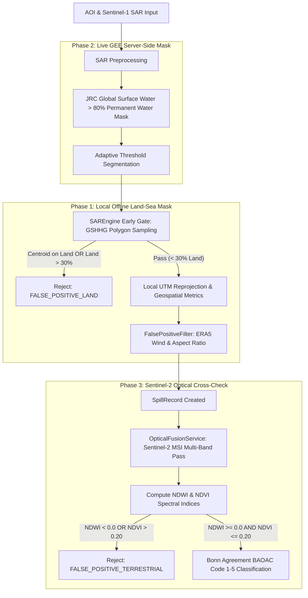

# Automated Land-Sea Masking & Terrestrial False-Positive Rejection

## Summary of Implementation

We have implemented an end-to-end, multi-layered automated land-sea masking system to eliminate false positives caused by inland lakes, reservoir basins (such as Tasik Kenyir in Terengganu, Malaysia), calm rivers, mountain radar shadows, and terrestrial dark-backscatter features.

---

## Defense-in-Depth Architecture



---

## Detailed Changes by Phase

### Phase 1: Local / Offline Land-Sea Mask
- **Dependency**: Verified `global-land-mask>=1.0.0` in [requirements.txt](file:///c:/Users/dhanu/SIH7926/backend/requirements.txt).
- **[FalsePositiveFilter](file:///c:/Users/dhanu/SIH7926/backend/app/services/false_positive_filter.py)**:
  - Added `sample_polygon_points()` to extract coordinate samples from the centroid, exterior boundary perimeter, and regular interior grid.
  - Added `check_geometry_is_land()` to evaluate land fraction against configurable threshold `LAND_MASK_MAX_FRACTION` (default 30%).
  - If the centroid is on land or the land fraction exceeds the threshold, rejects candidate with audit code `FALSE_POSITIVE_LAND`.
- **[SAREngine](file:///c:/Users/dhanu/SIH7926/backend/app/services/sar_engine.py)**:
  - Applied `check_geometry_is_land()` as an early gate immediately after candidate extraction, discarding terrestrial dark spots before executing UTM reprojection or metric characterization.

### Phase 2: Earth Engine-Native Masking for Live GEE Mode
- In `SAREngine._detect_gee()`:
  - Applied server-side permanent water mask (`ee.Image("JRC/GSW1_4/GlobalSurfaceWater").select("occurrence").gt(80).unmask(0)`) via `vv.updateMask(water_mask)` before focal median filtering and adaptive thresholding.
  - Prevents terrestrial pixels from ever entering segmentation in live Earth Engine mode.

### Phase 3: Sentinel-2 Optical Cross-Check
- **[OpticalFusionService](file:///c:/Users/dhanu/SIH7926/backend/app/services/optical_fusion_service.py)**:
  - Added `calculate_spectral_indices(b3_green, b4_red, b8_nir)` computing:
    $$\text{NDWI} = \frac{B_3 - B_8}{B_3 + B_8}, \quad \text{NDVI} = \frac{B_8 - B_4}{B_8 + B_4}$$
  - If $\text{NDWI} < 0.0$ (not open water) or $\text{NDVI} > 0.20$ (vegetation/terrestrial signature present), rejects candidate as `FALSE_POSITIVE_TERRESTRIAL`.
  - Non-blocking when optical imagery is still awaiting pass.

### Phase 4: Configuration, Logging, and Test Verification
- **[Environment Configuration](file:///c:/Users/dhanu/SIH7926/backend/.env.example)**:
  - Added configurable parameters: `LAND_MASK_MAX_FRACTION=0.30`, `OPTICAL_NDWI_MIN_THRESHOLD=0.0`, `OPTICAL_NDVI_MAX_THRESHOLD=0.20`, `MIN_WIND_SPEED_MS=2.0`, `MAX_WIND_SPEED_MS=14.0`.
- **[Test Suite](file:///c:/Users/dhanu/SIH7926/backend/test_land_masking.py)**:
  - Dedicated tests for inland lake rejection (Tasik Kenyir), coastline straddling polygons, offshore preservation (Strait of Malacca & Mumbai High), optical terrestrial cross-check, and threshold customization.
- **Manual Deletion Endpoints**:
  - Maintained `DELETE /api/v1/spills/{spill_id}` and `DELETE /api/v1/spills` unchanged for clearing legacy records.

---

## Verification Results

### 1. Dedicated Land Masking Test Suite (`test_land_masking.py`)
```bash
Ran 7 tests in 0.471s
OK
```
- `test_global_land_mask_dependency_available` -> **PASSED**
- `test_tasik_kenyir_inland_lake_rejected_phase1` -> **PASSED** (`FALSE_POSITIVE_LAND` triggered)
- `test_straddling_coastline_polygon_land_fraction_rejection` -> **PASSED**
- `test_offshore_preservation_malacca_and_mumbai` -> **PASSED** (0% land fraction, preserved)
- `test_sar_engine_detection_inland_lake_vs_offshore` -> **PASSED** (0 spills on Tasik Kenyir, legitimate spills detected on Malacca Strait)
- `test_optical_terrestrial_cross_check_phase3` -> **PASSED** (`FALSE_POSITIVE_TERRESTRIAL` triggered on negative NDWI / high NDVI)
- `test_configurable_thresholds_override` -> **PASSED**

### 2. Full Backend Regression Suite (All 45 tests)
```bash
Ran 45 tests in 25.565s
OK
```
All modules (`test_pipeline.py`, `test_optical_fusion.py`, `test_sar_thickness.py`, `test_drift.py`, `test_evidence_ledger.py`, `test_vessel_attribution.py`, `test_report_generation.py`, `test_assembled_dashboard.py`, `test_land_masking.py`) passed without regressions.
